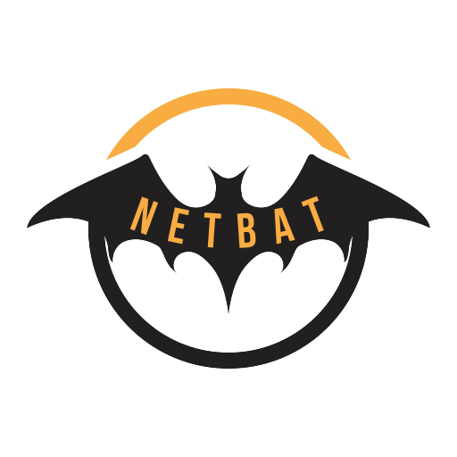

    

<h1 align="center">Netbat</h1>

Netbat is a tool greatly inspired by netcat, made in Python.

Disclaimer : purposedly made for experimenting with network sockets.

    
    
     
    

# Usage

todo

# Installation

todo